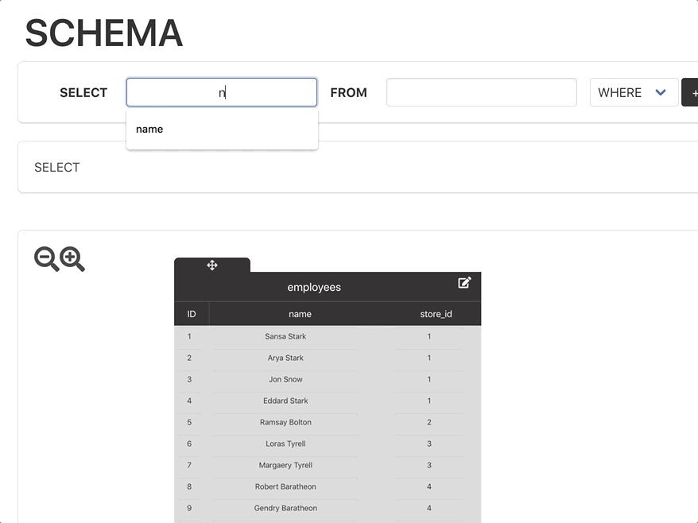
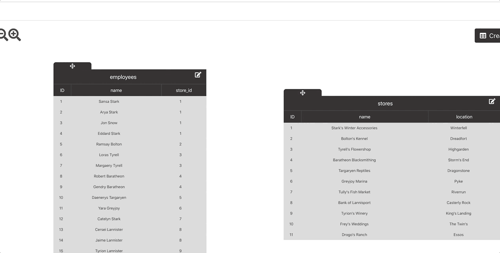

## mySchemaQL
<a href="https://myschemaql.netlify.com"> Demo </a>
This is a single page app use to create Entity-Relationship-Diagrams and write SQL queries 

alt-click to create arrows

### `npm run react`
`npm run react` in CLI to start app

### Bugs and missing features
- moving tables while the table Title input field is selected will cause tables to be deleted
- we do not currently have the ability to delete tables, or create/delete columns, or create rows after tables are created
- Our raw SQL query code that is displayed under the query fields may not be correct

### Dependencies
 - @ajainarayanan/react-pan-zoom
 - bulma-carousel
 - react
 - react-draggable
 - react-lineto
 - react-validation
 - socket.io